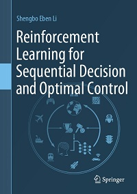

# Apress Source Code

This repository accompanies [Reinforcement Learning for Sequential Decision and Optimal Control](https://link.springer.com/book/10.1007/978-981-19-7784-8) by Shengbo Eben Li (SpringerNature, 2023).

[comment]: #cover


Download the files as a zip using the green button, or clone the repository to your machine using Git.

## Releases

Release v1.0 corresponds to the code in the published book, without corrections or updates.

## Run codes of this book
Setup conda first, and install dependencies.
```bash
conda env create -n rlbook -f environment.yml
conda activate rlbook
```
Then open each folder and run `main` or `plot` Python script.

## Source Layout
1. `Chap_3_4_CleanRobot`: Code for robot cleaning example in Chapter 3 and 4.
2. `Chap_5_AutoCar_GridRoad`: Code for autonomous car example in Chapter 5.
3. `Chap_6_Actor_Critic_Algorithm`: Code for actor-critic algorithm in Chapter 6.
4. `Chap_7_AC_wtih_Baseline`: Code for AC algorithm with baseline comparison in Chapter 7.
5. `Chap_8_Veh_Track_Ctrl`: Code for vehicle tracking control example in Chapter 8.
6. `Chap_9_Car_Brake_Control`: Code for emergency braking control example in Chapter 9.

## Contributions

See the file Contributing.md for more information on how you can contribute to this repository.
